---
## Front matter
title: "ОТЧЕТ ПО ЛАБОРАТОРНОЙ РАБОТЕ № 4"
subtitle: "дисциплина:	Архитектура компьютера"
author: "Мошаров Денис Максимович"

## Generic otions
lang: ru-RU
toc-title: "Содержание"

## Bibliography
bibliography: bib/cite.bib
csl: pandoc/csl/gost-r-7-0-5-2008-numeric.csl

## Pdf output format
toc: true # Table of contents
toc-depth: 2
lof: true # List of figures
fontsize: 12pt
linestretch: 1.5
papersize: a4
documentclass: scrreprt
## I18n polyglossia
polyglossia-lang:
  name: russian
  options:
	- spelling=modern
	- babelshorthands=true
polyglossia-otherlangs:
  name: english
## I18n babel
babel-lang: russian
babel-otherlangs: english
## Fonts
mainfont: PT Serif
romanfont: PT Serif
sansfont: PT Sans
monofont: PT Mono
mainfontoptions: Ligatures=TeX
romanfontoptions: Ligatures=TeX
sansfontoptions: Ligatures=TeX,Scale=MatchLowercase
monofontoptions: Scale=MatchLowercase,Scale=0.9
## Biblatex
biblatex: true
biblio-style: "gost-numeric"
biblatexoptions:
  - parentracker=true
  - backend=biber
  - hyperref=auto
  - language=auto
  - autolang=other*
  - citestyle=gost-numeric
## Pandoc-crossref LaTeX customization
figureTitle: "Рис."
tableTitle: "Таблица"
listingTitle: "Листинг"
lolTitle: "Листинги"
## Misc options
indent: true
header-includes:
  - \usepackage{indentfirst}
  - \usepackage{float} # keep figures where there are in the text
  - \floatplacement{figure}{H} # keep figures where there are in the text
---
# Цель работы

Целью данной работы является изучение процесса создания и обработки программ на языке ассемблера NASM. Это включает в себя следующие задачи: 
1.Изучение основ языка ассемблера NASM. 
2.Разработка программы на языке ассемблера NASM. 
3.Отладка и тестирование разработанной программы. 
4.Анализ результатов работы программы.

# Задание

Овладение процессом компиляции и сборки программ, созданных на языке ассемблера NASM.

# Теоретическое введение

# Теоретическое введение
## Основные принципы работы компьютера

	Основными функциональными элементами любой электронно-вычислительной машины
(ЭВМ) являются центральный процессор, память и периферийные устройства.
Взаимодействие этих устройств осуществляется через общую шину, к которой они подклю-
чены. Физически шина представляет собой большое количество проводников, соединяющих
устройства друг с другом. В современных компьютерах проводники выполнены в виде элек-
тропроводящих дорожек на материнской (системной) плате.
Основной задачей процессора является обработка информации, а также организация
координации всех узлов компьютера. В состав центрального процессора (ЦП) входят
следующие устройства: 
	арифметико-логическое устройство (АЛУ) — выполняет логические и арифметиче-
ские действия, необходимые для обработки информации, хранящейся в памяти; 
	устройство управления (УУ) — обеспечивает управление и контроль всех устройств
компьютера; 
	регистры — сверхбыстрая оперативная память небольшого объёма, входящая в со-
став процессора, для временного хранения промежуточных результатов выполнения
инструкций; регистры процессора делятся на два типа: регистры общего назначения и
специальные регистры. 
	Для того, чтобы писать программы на ассемблере, необходимо знать, какие регистры
процессора существуют и как их можно использовать. Большинство команд в программах
написанных на ассемблере используют регистры в качестве операндов. Практически все
команды представляют собой преобразование данных хранящихся в регистрах процессора,
это например пересылка данных между регистрами или между регистрами и памятью, пре-
образование (арифметические или логические операции) данных хранящихся в регистрах. 
	Доступ к регистрам осуществляется не по адресам, как к основной памяти, а по именам.
Каждый регистр процессора архитектуры x86 имеет свое название, состоящее из 2 или 3
букв латинского алфавита. 
	В качестве примера приведем названия основных регистров общего назначения (именно
эти регистры чаще всего используются при написании программ): 

• RAX, RCX, RDX, RBX, RSI, RDI — 64-битные
• EAX, ECX, EDX, EBX, ESI, EDI — 32-битные
• AX, CX, DX, BX, SI, DI — 16-битные
• AH, AL, CH, CL, DH, DL, BH, BL — 8-битные (половинки 16-битных регистров). Например,
AH (high AX) — старшие 8 бит регистра AX, AL (low AX) — младшие 8 бит регистра AX. 

	Таким образом можно отметить, что вы можете написать в своей программе, например,
такие команды (mov – команда пересылки данных на языке ассемблера): 

	mov ax, 1
	mov eax, 1
	  
	Обе команды поместят в регистр AX число 1. Разница будет заключаться только в том, что
вторая команда обнулит старшие разряды регистра EAX, то есть после выполнения второй
команды в регистре EAX будет число 1. А первая команда оставит в старших разрядах регистра
EAX старые данные. И если там были данные, отличные от нуля, то после выполнения первой
команды в регистре EAX будет какое-то число, но не 1. А вот в регистре AX будет число 1. 
	Другим важным узлом ЭВМ является оперативное запоминающее устройство (ОЗУ).
ОЗУ — это быстродействующее энергозависимое запоминающее устройство, которое на-
прямую взаимодействует с узлами процессора, предназначенное для хранения программ и
данных, с которыми процессор непосредственно работает в текущий момент. ОЗУ состоит из
одинаковых пронумерованных ячеек памяти. Номер ячейки памяти — это адрес хранящихся
в ней данных. 
	В состав ЭВМ также входят периферийные устройства, которые можно разделить на: 
• устройства внешней памяти, которые предназначены для долговременного хране-
ния больших объёмов данных (жёсткие диски, твердотельные накопители, магнитные
ленты); 
• устройства ввода-вывода, которые обеспечивают взаимодействие ЦП с внешней
средой. 
	В основе вычислительного процесса ЭВМ лежит принцип программного управления.
Это означает, что компьютер решает поставленную задачу как последовательность действий,
записанных в виде программы. Программа состоит из машинных команд, которые указыва-
ют, какие операции и над какими данными (или операндами), в какой последовательности
необходимо выполнить. 
Набор машинных команд определяется устройством конкретного процессора. Коды ко-
манд представляют собой многоразрядные двоичные комбинации из 0 и 1. В коде машинной
команды можно выделить две части: операционную и адресную. В операционной части хра-
нится код команды, которую необходимо выполнить. В адресной части хранятся данные
или адреса данных, которые участвуют в выполнении данной операции. 
	При выполнении каждой команды процессор выполняет определённую последователь-
ность стандартных действий, которая называется командным циклом процессора. В
самом общем виде он заключается в следующем: 
1. формирование адреса в памяти очередной команды;
2. считывание кода команды из памяти и её дешифрация;
3. выполнение команды;
4. переход к следующей команде. 
	Данный алгоритм позволяет выполнить хранящуюся в ОЗУ программу. Кроме того, в
зависимости от команды при её выполнении могут проходить не все этапы. 

## Ассемблер и язык ассемблера  

	Язык ассемблера (assembly language, сокращённо asm) — машинно-ориентированный
язык низкого уровня. Можно считать, что он больше любых других языков приближен к
архитектуре ЭВМ и её аппаратным возможностям, что позволяет получить к ним более
полный доступ, нежели в языках высокого уровня, таких как C/C++, Perl, Python и пр. Заметим,
что получить полный доступ к ресурсам компьютера в современных архитектурах нельзя,
самым низким уровнем работы прикладной программы является обращение напрямую к
ядру операционной системы. Именно на этом уровне и работают программы, написанные
на ассемблере. Но в отличие от языков высокого уровня ассемблерная программа содержит
только тот код, который ввёл программист. Таким образом язык ассемблера — это язык, с
помощью которого понятным для человека образом пишутся команды для процессора. 
	Следует отметить, что процессор понимает не команды ассемблера, а последовательности
из нулей и единиц — машинные коды. До появления языков ассемблера программистам
приходилось писать программы, используя только лишь машинные коды, которые были
крайне сложны для запоминания, так как представляли собой числа, записанные в двоичной
или шестнадцатеричной системе счисления. Преобразование или трансляция команд с языка ассемблера в исполняемый машинный код осуществляется специальной программой
транслятором — Ассемблер. 
	Программы, написанные на языке ассемблера, не уступают в качестве и скорости програм-
мам, написанным на машинном языке, так как транслятор просто переводит мнемонические
обозначения команд в последовательности бит (нулей и единиц). 
	Используемые мнемоники обычно одинаковы для всех процессоров одной архитектуры
или семейства архитектур (среди широко известных — мнемоники процессоров и контрол-
леров x86, ARM, SPARC, PowerPC,M68k). Таким образом для каждой архитектуры существует
свой ассемблер и, соответственно, свой язык ассемблера. 
	Наиболее распространёнными ассемблерами для архитектуры x86 являются: 
	• для DOS/Windows: Borland Turbo Assembler (TASM), Microsoft Macro Assembler (MASM) и
Watcom assembler (WASM); 
	• для GNU/Linux: gas (GNU Assembler), использующий AT&T-синтаксис, в отличие от
большинства других популярных ассемблеров, которые используют Intel-синтаксис. 
	Более подробно о языке ассемблера см., например, в [10]. 
	В нашем курсе будет использоваться ассемблер NASM (Netwide Assembler) [7; 12; 14]. 
	NASM — это открытый проект ассемблера, версии которого доступны под различные
операционные системы и который позволяет получать объектные файлы для этих систем. В
NASM используется Intel-синтаксис и поддерживаются инструкции x86-64. 
Типичный формат записи команд NASM имеет вид: 

[метка:] мнемокод [операнд {, операнд}] [; комментарий] 

	Здесь мнемокод — непосредственно мнемоника инструкции процессору, которая является
обязательной частью команды. Операндами могут быть числа, данные, адреса регистров или
адреса оперативной памяти. Метка — это идентификатор, с которым ассемблер ассоциирует
некоторое число, чаще всего адрес в памяти. Т.о. метка перед командой связана с адресом
данной команды. 
	Допустимыми символами в метках являются буквы, цифры, а также следующие символы: 
	
_, $, #, @,~,. и ?. 

	Начинаться метка или идентификатор могут с буквы, ., _ и ?. Перед идентификаторами,
которые пишутся как зарезервированные слова, нужно писать $, чтобы компилятор тракто-
вал его верно (так называемое экранирование). Максимальная длина идентификатора 4095
символов. 
	Программа на языке ассемблера также может содержать директивы — инструкции, не пе-
реводящиеся непосредственно в машинные команды, а управляющие работой транслятора.
Например, директивы используются для определения данных (констант и переменных) и
обычно пишутся большими буквами. 

## Процесс создания и обработки программы на языке ассемблера  

	В процессе создания ассемблерной программы можно выделить четыре шага: 
	• Набор текста программы в текстовом редакторе и сохранение её в отдельном файле. 
Каждый файл имеет свой тип (или расширение), который определяет назначение файла.
Файлы с исходным текстом программ на языке ассемблера имеют тип asm.
	• Трансляция — преобразование с помощью транслятора, например nasm, текста про-
граммы в машинный код, называемый объектным. На данном этапе также может быть
получен листинг программы, содержащий кроме текста программы различную допол-
нительную информацию, созданную транслятором. Тип объектного файла — o, файла
листинга — lst. 
	• Компоновка или линковка — этап обработки объектного кода компоновщиком (ld),
который принимает на вход объектные файлы и собирает по ним исполняемый файл.
Исполняемый файл обычно не имеет расширения. Кроме того, можно получить файл
карты загрузки программы в ОЗУ, имеющий расширение map. 
	• Запуск программы. Конечной целью является работоспособный исполняемый файл.
Ошибки на предыдущих этапах могут привести к некорректной работе программы,
поэтому может присутствовать этап отладки программы при помощи специальной
программы — отладчика. При нахождении ошибки необходимо провести коррекцию
программы, начиная с первого шага. 
	Из-за специфики программирования, а также по традиции для создания программ на язы-
ке ассемблера обычно пользуются утилитами командной строки (хотя поддержка ассемблера
есть в некоторых универсальных интегрированных средах). 
# Выполнение лабораторной работы

Создайте каталог для работы с программами на языке ассемблера NASM и Перейдите в созданный каталог

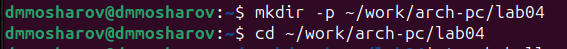{#fig:001 width=70%}

Создайте текстовый файл с именем hello.asm

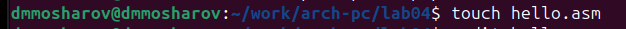{#fig:001 width=70%}

откройте этот файл с помощью любого текстового редактора, например, gedit и введите в него текс

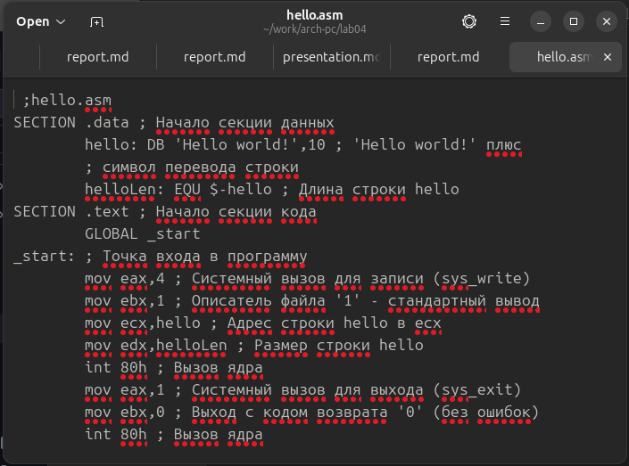{#fig:001 width=70%}

скомпилируем текст

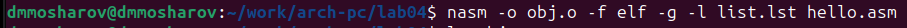{#fig:001 width=70%}

скомпилируем исходный файл hello.asm в obj.o

{#fig:001 width=70%}

оъектный файл необходимо передать на обработку компоновщику

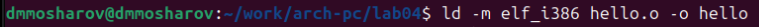{#fig:001 width=70%}

Ключ -o с последующим значением задаёт в данном случае имя создаваемого исполняемого файла.

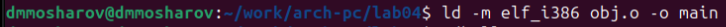{#fig:001 width=70%}

Запустить на выполнение созданный исполняемый файл, 

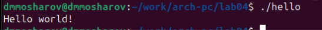{#fig:001 width=70%}

# Выполнениие самостоятельной работы

В каталоге ~/work/arch-pc/lab04 с помощью команды cp создайте копию файла hello.asm с именем lab4.asm

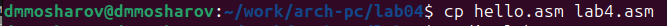{#fig:001 width=70%}

С помощью любого текстового редактора внесите изменения в текст программы в файле lab4.asm так, чтобы вместо Hello world! на экран выводилась строка с вашими фамилией и именем

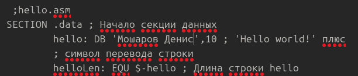{#fig:001 width=70%}

Оттранслируйте полученный текст программы lab4.asm в объектный файл.Выполните компоновку объектного файла и запустите получившийся исполняемый файл.

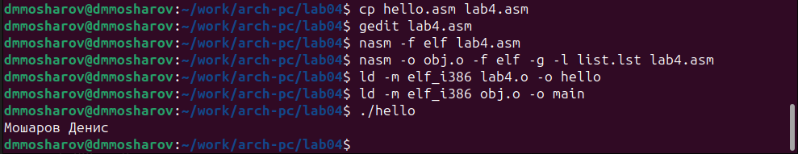{#fig:001 width=70%}

Скопируйте файлы hello.asm и lab4.asm в Ваш локальный репозиторий в каталог ~/work/study2023-2024/"Архитектура компьютера"/arch-pc/labs/lab04/.

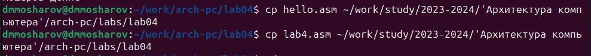{#fig:001 width=70%}

Загрузите файлы на Github.

{#fig:001 width=70%}

# Выводы

Были изучены основы языка ассемблера NASM, включая его синтаксис, структуру программы и основные команды. Была разработана программа на языке ассемблера NASM, проведена ее отладка и тестирование.

