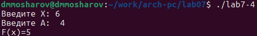

---
## Front matter
title: "Отчёта по лабораторной работе №7"
subtitle: "Команды безусловного и условного переходов в Nasm. Программирование ветвлений."
author: "Мошаров Денис Максимович"

## Generic otions
lang: ru-RU
toc-title: "Содержание"

## Bibliography
bibliography: bib/cite.bib
csl: pandoc/csl/gost-r-7-0-5-2008-numeric.csl

## Pdf output format
toc: true # Table of contents
toc-depth: 2
lof: true # List of figures
fontsize: 12pt
linestretch: 1.5
papersize: a4
documentclass: scrreprt
## I18n polyglossia
polyglossia-lang:
  name: russian
  options:
	- spelling=modern
	- babelshorthands=true
polyglossia-otherlangs:
  name: english
## I18n babel
babel-lang: russian
babel-otherlangs: english
## Fonts
mainfont: PT Serif
romanfont: PT Serif
sansfont: PT Sans
monofont: PT Mono
mainfontoptions: Ligatures=TeX
romanfontoptions: Ligatures=TeX
sansfontoptions: Ligatures=TeX,Scale=MatchLowercase
monofontoptions: Scale=MatchLowercase,Scale=0.9
## Biblatex
biblatex: true
biblio-style: "gost-numeric"
biblatexoptions:
  - parentracker=true
  - backend=biber
  - hyperref=auto
  - language=auto
  - autolang=other*
  - citestyle=gost-numeric
## Pandoc-crossref LaTeX customization
figureTitle: "Рис."
tableTitle: "Таблица"
listingTitle: "Листинг"
lofTitle: "Список иллюстраций"
lolTitle: "Листинги"
## Misc options
indent: true
header-includes:
  - \usepackage{indentfirst}
  - \usepackage{float} # keep figures where there are in the text
  - \floatplacement{figure}{H} # keep figures where there are in the text
---
# Цель работы

Освоить условного и безусловного перехода. Ознакомиться с назначением и структурой файла листинга.

# Задание

Написать программы для решения системы выражений.

# Выполнение лабораторной работы

## Реализация переходов в NASM

Создаем каталог для программ ЛБ7, и в нем создаем файл (рис. @fig:001).

{#fig:001 width=70%}

Открываем файл в Midnight Commander и заполняем его в соответствии с листингом 7.1 (рис. @fig:002).

{#fig:001 width=70%}

Создаем исполняемый файл и запускаем его (рис. @fig:003).

{#fig:003 width=70%}

Снова открываем файл для редактирования и изменяем его в соответствии с листингом 7.2 (рис. @fig:004).

{#fig:004 width=70%}

Создаем исполняемый файл и запускаем его (рис. @fig:005).

{#fig:005 width=70%}

Создаем новый файл (рис. @fig:008).

{#fig:008 width=70%}

Открываем файл в Midnight Commander и заполняем его в соответствии с листингом 7.3 (рис. @fig:009).

{#fig:009 width=70%}

Создаем исполняемый файл и проверяем его работу, вводя разные значения B (рис. @fig:010).

{#fig:010 width=70%}

## Изучение структуры файлы листинга

Открываем файл листинга с помощью команды mcedit и изучаем его (рис. @fig:012).

{#fig:012 width=70%}

Строка 33: 0000001D-адрес в сегменте кода, BB01000000-машинный код, mov ebx,1-присвоение переменной ecx значения 1.

Строка 34: 00000022-адрес в сегменте кода, B804000000-машинный код, mov eax,4-присвоение переменной eax значения 4.

Строка 35 00000027-адрес в сегменте кода, CD80-машинный код, int 80h-вызов ядра.

Открываем файл и удаляем один операндум (рис. @fig:013).

{#fig:013 width=70%}

Транслируем с получением файла листинга 
При трансляции файла, выдается ошибка, но создаются исполнительный файл lab7-2 и lab7-2.lst

## Задание для самостоятельной работы
ВАРИАНТ-2

1. Напишите программу нахождения наименьшей из 3 целочисленных переменных a,b и c.Значения переменных выбрать из табл. 7.5 в соответствии с вариантом, полученнымпри выполнении лабораторной работы № 7. Создайте исполняемый файл и проверьте его работу.

Создаем новый файл (рис. @fig:014).

{#fig:014 width=70%}

Открываем его и пишем программу, которая выберет наименбшее число из трех(2 числа уже в программе, 3е вводится из консоли) (рис. @fig:015).

{#fig:015 width=70%}

Транслируем файл и смотрим на работу программы (рис. @fig:016).

{#fig:016 width=70%}

2. Напишите программу, которая для введенных с клавиатуры значений x и a вычисляет значение заданной функции f(x) и выводит результат вычислений. Вид функции f(x) выбрать из таблицы 7.6 вариантов заданий в соответствии с вариантом, полученным при выполнении лабораторной работы № 7. Создайте исполняемый файл и проверьте его работу для значений x и a из 7.6.

Создаем новый файл (рис. @fig:017).

{#fig:017 width=70%}

Открываем его и пишем программу, которая решит систему уравнений, при даных, введенных в консоль (рис. @fig:018).

{#fig:018 width=70%}

Транслируем файл и проверяем его работу при x=1 и a=1(рис. @fig:019).

{#fig:020 width=70%}

Транслируем файл и проверяем его работу при x=2 и a=2(рис. @fig:021).

{#fig:022 width=70%}

# Выводы

Мы познакомились с структурой файла листинга, изучили команды условного и безусловного перехода.

